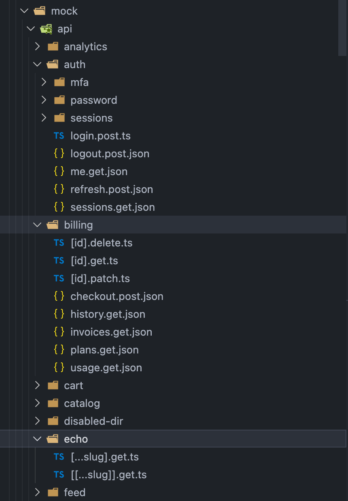
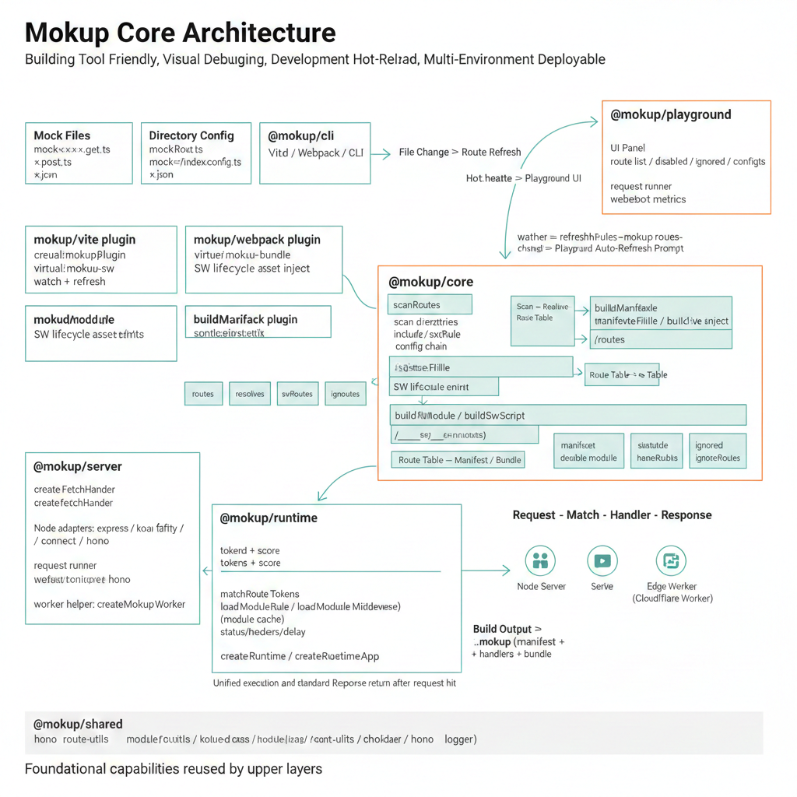

# Mokup: A Build-Tool-Friendly Visual Mocking Tool


Hi, I am [icebreaker](https://github.com/sonofmagic), a frontend developer and open source enthusiast.

I want to share a project I have been working on recently: Mokup, a file-based HTTP mocking tool.

Project links: [GitHub](https://github.com/sonofmagic/mokup), docs site: http://mokup.icebreaker.top/

## What is Mokup

Mokup is a file-based HTTP mocking tool. You put mock files in the `mock/` directory, and it automatically scans them, builds matching routes, and returns responses.

Its goal is straightforward: help mocks run quickly inside your existing frontend project, and reduce the cost of building a separate service just for API collaboration.

## Key features

- Build-tool friendly: works with both Vite and Webpack without forcing a project rewrite.
- Visual debugging: built-in Playground, so route status is visible at a glance.
- Great developer experience: mock file and config updates refresh automatically, without frequent restarts.
- Deployable to multiple environments: local dev, Node.js server, Worker, and Service Worker.

## Why I built it

For many teams, the pain is not writing mocks. The pain is:

- Too many setup steps, and reconfiguration every time the build tool changes.
- Poor visibility during local debugging, so people guess by reading files.
- Slow feedback loops when every mock change needs a restart or manual verification.

Mokup is designed to solve these three issues: lighter setup, stronger visualization, and faster feedback.

## Build-tool friendly

### Vite integration

```ts
import mokup from 'mokup/vite'

export default {
  plugins: [
    mokup({
      entries: { dir: 'mock', prefix: '/api' },
    }),
  ],
}
```

At this point, you can add files under `mock/`, and Mokup will scan them and generate routes automatically.

You can also open Mokup Playground from your CLI output for visual debugging.


### Webpack integration

```js
const { mokupWebpack } = require('mokup/webpack')

const withMokup = mokupWebpack({
  entries: { dir: 'mock', prefix: '/api' },
})

module.exports = withMokup({})
```

This lets you add mock capability into your existing build pipeline without changing your business code structure.

## Visualization: Playground (highlight)

Mokup includes a built-in Playground to inspect scanned routes, methods, paths, and config chains.

Default entry in Vite dev:

```txt
http://localhost:5173/__mokup
```

Online demo: <https://mokup.icebreaker.top/__mokup/>


It solves a practical problem:
when an endpoint does not work, you do not need to grep everywhere. Open the page and you can immediately see whether the route was scanned, disabled, and which config matched.

## Developer experience: what supports hot reload

In Vite dev, Mokup watches mock directories and refreshes the route table automatically. Typical changes that trigger hot reload include:

- Add/modify/delete route files, for example:
  - `mock/users.get.ts`
  - `mock/messages.get.json`
  - `mock/orders/[id].patch.ts`
- Modify directory config files: `mock/**/index.config.ts`
- Change directory structure (move, rename, create nested folders)

After changes, Playground refreshes route lists automatically, making debugging much faster.
If you do not need file watching, set `watch: false` in `entries`.

## Quick example: from file to response

```ts
// mock/users.get.ts
import { defineHandler } from 'mokup'

export default defineHandler({
  handler: c => c.json([{ id: 1, name: 'Ada' }]),
})
```

Start dev and visit `/api/users` (assuming you set `prefix: '/api'`), then you get mock data.



## Quick integration with @faker-js/faker

Mokup handlers are plain TS/JS functions, so you can integrate with `@faker-js/faker` directly, without any extra adapter layer.

This example returns a user list based on the `size` query parameter:

```ts
// mock/users.get.ts
import { faker } from '@faker-js/faker'
import { defineHandler } from 'mokup'

export default defineHandler((c) => {
  const size = Number(c.req.query('size') ?? 10)
  const count = Number.isNaN(size) ? 10 : Math.min(Math.max(size, 1), 50)
  const list = Array.from({ length: count }, () => ({
    id: faker.string.uuid(),
    name: faker.person.fullName(),
    email: faker.internet.email(),
    city: faker.location.city(),
    createdAt: faker.date.recent({ days: 30 }).toISOString(),
  }))

  return c.json({
    list,
    total: 200,
    page: 1,
    pageSize: count,
  })
})
```

This is very useful for list, search, and detail page integration.
If you need reproducible results, add `faker.seed(123)` at the top of the handler.

## Deployable to multiple environments

The same mock setup can run in multiple environments: for example, directly in Node.js, and also deployed to Cloudflare Workers.

Node.js dev mode example:

```ts
import { createFetchServer, serve } from 'mokup/server/node'

const app = await createFetchServer({ entries: { dir: 'mock' } })
serve({ fetch: app.fetch, port: 3000 })
```

Cloudflare Worker example:

```ts
import { createMokupWorker } from 'mokup/server/worker'
import mokupBundle from 'virtual:mokup-bundle'

export default createMokupWorker(mokupBundle)
```

Note: `virtual:mokup-bundle` is only available in Vite with `@cloudflare/vite-plugin`. In Node.js dev mode, use `createFetchServer` directly and you do not need that virtual module.

## Core architecture



## Use cases and boundaries

Good fit:

- Teams with existing Vite/webpack projects that want low-cost mock integration
- Projects that need visual route diagnostics
- Workflows that value fast feedback after mock updates

Less suitable:

- Scenarios that depend heavily on complex dynamic proxy chains
- Extremely lightweight setups that do not want build-time or plugin-based integration

Mokup is not trying to replace every mock solution. It is designed to make mocks easier to adopt, easier to debug, and better aligned with everyday development workflows.

## Closing

Mokup is still evolving quickly. Feedback is very welcome, including feature requests, DX feedback, and documentation improvements.
