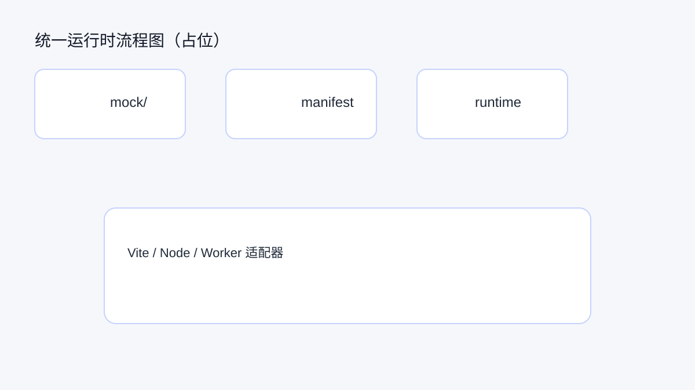
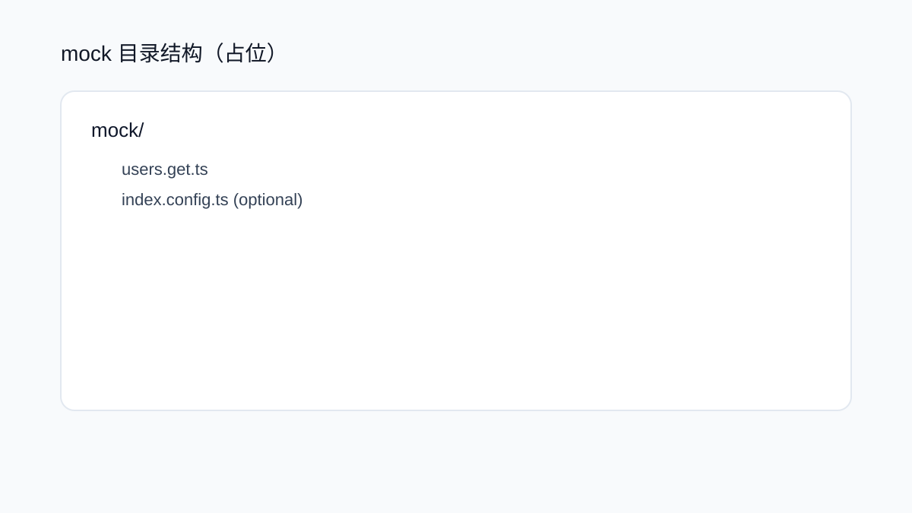
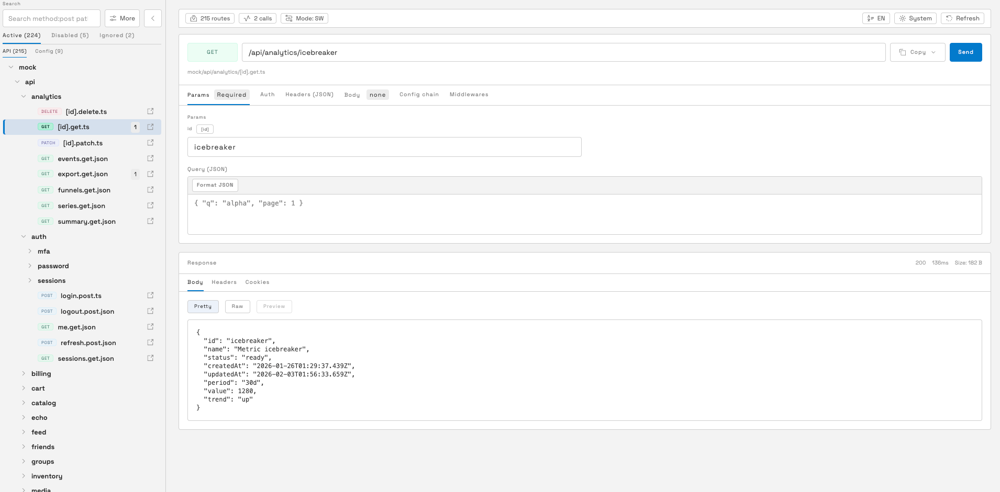
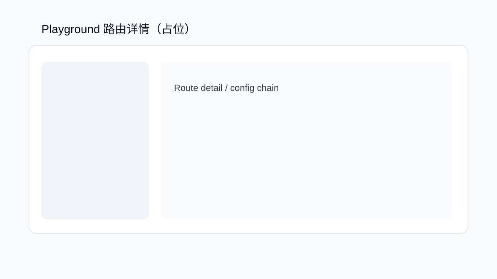
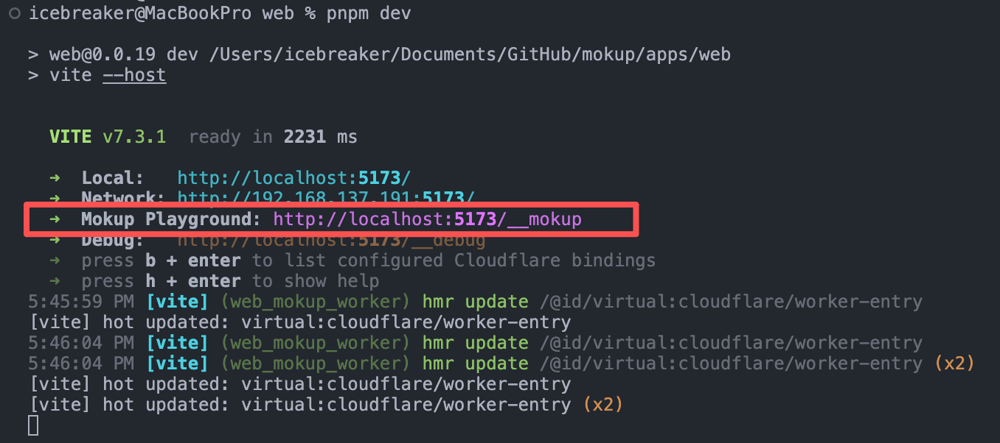

# Mokup：统一运行时的 Mock 库（草稿）


大家好，我是 icebreaker，一名前端开发者兼开源爱好者。这是我的 [GitHub](https://github.com/sonofmagic)。

这篇不是长篇论文，而是我把“写 mock 写到怀疑人生”的经验，浓缩成一个项目：Mokup。

项目地址：[GitHub](https://github.com/sonofmagic/mokup)
官网与文档：http://mokup.icebreaker.top/

## 要点速览

- Mokup 是一个“统一运行时”的 HTTP mock 库。
- 写一次 mock，能在 Vite/Node/Service Worker/Worker 里跑。
- 核心是：文件路由 + manifest + 同一套 runtime。
- 适合想降低联调成本、减少“写一次改三次”的团队。
- 如果你热爱在三个环境里修同一个 bug，这篇可以先收藏，慢慢看（我懂你）。

## Mokup 是什么

Mokup 是一个基于文件路由的 HTTP mock 库，强调“统一运行时”。

你把 mock 文件放在 `mock/` 目录下，Mokup 会扫描生成 manifest，运行时读取 manifest 来匹配请求并输出响应。

一句话：写一次，统一运行，环境只是适配器。

支持的场景：

- Vite/Webpack dev server 中间件（本地开发）
- 浏览器 Service Worker（更接近真实网络行为）
- Node 服务端适配器（Express/Koa/Fastify/Hono/Connect）
- Worker 运行时（Cloudflare Worker 等边缘环境）

## 我为什么要写 Mokup

我想要一个更好的本地 mock 体验，但又不想为每个运行时维护一套逻辑。

现实是：浏览器、Node、Worker 都有各自的规则。很多工具在单一环境里很爽，一跨环境就变成“迁移与改造季”。

这会发生什么？

- 前端同学为了联调改来改去，成本飙升。
- 选型同学为了稳定性背锅，压力拉满。
- 团队为了“能跑”写了一堆不同版本的 mock，最后谁也不想维护。

我不想再在三个环境里背同一个锅。于是有了 Mokup。

## 一分钟心智模型

1. 扫描 `mock/` 目录，生成路由 manifest。
2. runtime 使用 manifest 匹配请求并执行响应逻辑。
3. 各种适配器（Vite/Node/Worker）共享同一套 runtime。
4. 生产环境可直接复用构建产物（manifest + handler bundle）。

这意味着：路由规则一致、响应逻辑一致、部署方式可选。



## 快速开始（Vite）

接入 Vite 插件：

```ts
import mokup from 'mokup/vite'

export default {
  plugins: [
    mokup({
      entries: { dir: 'mock', prefix: '/api' },
    }),
  ],
}
```

编写 mock 处理器：

```ts
// mock/users.get.ts
export default {
  handler: c => c.json([{ id: 1, name: 'Ada' }]),
}
```

提示：可以使用 `defineHandler` 包裹导出以获得更好的类型提示：

```ts
import { defineHandler } from 'mokup'

export default defineHandler({
  handler: c => c.json([{ id: 1, name: 'Ada' }]),
})
```

启动 Vite 并访问 `/api/users`，你会得到一份真实可用的响应。之后这套路由还能直接迁移到 Node 或 Worker，无需重写。



## 可视化 Playground（重点）

Mokup 内置了一个可视化 Playground，用来浏览与调试当前扫描到的 mock 路由。

在 Vite 开发时默认访问路径：

```
http://localhost:5173/__mokup
```



你会看到分组后的路由列表、方法/路径信息、以及每个路由的目录配置链。



作用很简单：不用翻文件，就能确认这个接口到底有没有被扫到、是不是被禁了。
当你新增或修改 mock 文件时，Playground 会自动刷新路由列表，调试成本会明显降低。

如果你希望自定义入口或关闭 Playground，可以在插件配置里设置：

```ts
import mokup from 'mokup/vite'

export default {
  plugins: [
    mokup({
      entries: { dir: 'mock', prefix: '/api' },
      playground: { path: '/__mokup', enabled: true },
    }),
  ],
}
```

若不传 `playground`，默认会开启并使用 `/__mokup`（等价于 `playground: { path: '/__mokup', enabled: true }`），同时 `build` 默认是 `false`；如需关闭则设为 `playground: false`。

## 同一套 mock 部署到 Worker

如果你希望把本地 mock 迁移到 Worker 运行时，可以用构建产物和 Worker helper：

提示：`virtual:mokup-bundle` 这个虚拟模块仅在 Vite 与 `@cloudflare/vite-plugin` 的集成环境里可用；非该环境请使用对应平台的构建产物或接入方式。

```ts
import { createMokupWorker } from 'mokup/server/worker'
import mokupBundle from 'virtual:mokup-bundle'

export default createMokupWorker(mokupBundle)
```

或者使用 fetch handler：

```ts
import { createFetchHandler } from 'mokup/server/fetch'
import mokupBundle from 'virtual:mokup-bundle'

const handler = createFetchHandler(mokupBundle)
export default { fetch: request => handler(request) }
```



这样你就能在边缘环境复用本地的 mock 逻辑，避免多套实现。

## 适用场景与边界

适合：

- 需要“前端与服务端 mock 一致性”的团队或项目
- 希望 mock 能随环境迁移（本地/Node/Worker）的应用
- 追求可维护性的 mock 体系（统一路由规则与响应逻辑）

不太适合：

- 强依赖复杂动态代理/转发的场景
- 希望完全由浏览器注入、无构建流程的轻量 mock
- 对运行时体积极度敏感、又不愿做拆分的项目

## 常见问题（FAQ）

**Q1：Playground 会不会在生产环境也暴露出来？**
默认不会。`build` 默认是 `false`，生产构建不会输出 Playground；需要时再显式开启即可。
（放心，它不会主动在互联网上“开门迎客”，除非你点了允许。）

**Q2：可以只给一部分接口用 Mokup 吗？**
可以。你可以用 `entries.prefix` 把 mock 约束在某个前缀下，只接管指定范围。
这样你就能让真实接口和 mock 和平共处，互不打扰。

**Q3：我能只在本地用，线上不用吗？**
当然可以。Mokup 的设计就是“环境可选”，本地跑、线上停都行。
（你可以把它当作“只在开发时出现的队友”，不会强行上生产。）

**Q4：有没有更好的类型提示？**
有。用 `defineHandler` 包裹导出，就能获得更友好的类型提示与校验。

**Q5：最小迁移到 Node/Worker 的示例有吗？**
有。Node 端用 `createFetchHandler`，Worker 用 `createMokupWorker`；在 Vite + `@cloudflare/vite-plugin` 集成环境可直接复用 `virtual:mokup-bundle`，其他环境用对应构建产物即可。
（你只需要换个壳，路由逻辑不用改。）

Mokup 的定位不是“替代所有 mock 方案”，而是让 mock 在更多环境里保持一致。
如果你的团队已经被“写一次改三次”折磨过，这是一次值得尝试的解药。
